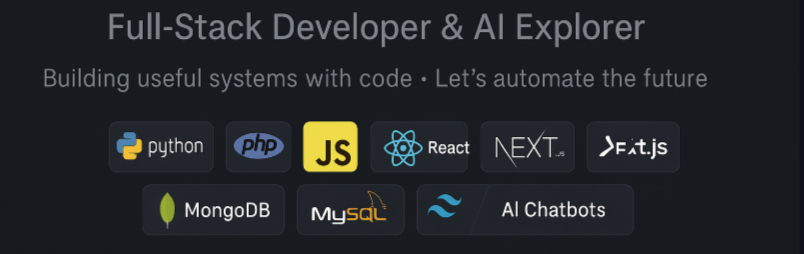

  

 
<h1 align="center">Hey Everyone 👋, I'm Majid Al-Badwi</h1>

<h3 align="center">
  A Full-Stack Developer & AI Explorer from the Middle East. 
  I build smart bots, dashboards, and powerful web platforms using modern tech.
</h3>

  
  
  
  

  

---

### 📌 About Me

- 🌐 Website: [albadwimajid.github.io/my-portfolio-/](https://albadwimajid.github.io/my-portfolio-/)
- 👨‍💻 GitHub: [github.com/albadwimajid](https://github.com/albadwimajid)
- 💬 Ask me about **Full-Stack Development, Chatbots, and AI Tools**
- 📫 Email: [albadwimajid755@gmail.com](mailto:albadwimajid755@gmail.com)

---

### 🚧 Currently Working On

- 🤖 AI-powered Telegram bot using OpenAI + ChromaDB
- 🛒 Full-stack e-commerce platform (PHP + Tailwind)
- 📈 Streamlit dashboard for machine learning analytics

---

### 🏆 Highlights

- ✅ Built 15+ real-world projects (bots, dashboards, systems)
- 🧠 Developed AI chatbot with RAG pipeline + ChromaDB
- 🌐 Designed and deployed a full personal portfolio
- 👨‍🏫 Helped peers with Git, MySQL, and full-stack basics

---
## 🤝 Connect with me:

 
 

# 💻 Tech Stack:

                               

---
## 🛠️ Tools & Technologies:

---

### 📊 GitHub Stats

  
  

---

### 🐍 GitHub Contribution Snake

<picture>
  <source media="(prefers-color-scheme: dark)" srcset="https://raw.githubusercontent.com/tobiasmeyhoefer/tobiasmeyhoefer/output/github-snake-dark.svg" />
  <source media="(prefers-color-scheme: light)" srcset="https://raw.githubusercontent.com/tobiasmeyhoefer/tobiasmeyhoefer/output/github-snake.svg" />
  
</picture>

---

### 👨‍💼 About Me & 🤝 Open to Collaborations

🎤 Available for **guest lectures / mentoring / automation projects**  
🤝 Open to **bot projects / AI tools / dashboards / internships**  
📧 Let's connect: [albadwimajid755@gmail.com](mailto:albadwimajid755@gmail.com)

> *"Empowering systems with smart automation — one commit at a time."*
